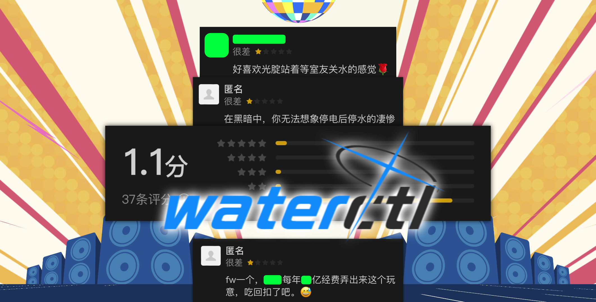

# 🛀 蓝牙水控器 FOSS (现代化版本)

深圳市常工电子"蓝牙水控器"控制程序的开源实现。适用于国内各大高校宿舍热水器。

本项目基于 [celesWuff/waterctl](https://github.com/celesWuff/waterctl) 原始代码进行二次开发，在保持完整功能的基础上优化了UI界面。



## 🏃 使用

- 🌎 开始使用： [https://katelya77.github.io/watercracker/](https://katelya77.github.io/watercracker/)
- 不能用？请先看看"疑难解答"： [FAQ.md](FAQ.md)

## ✨ 新增特性

- 🎨 **现代化玻璃磨砂质感UI界面** - 梯度背景 + 毛玻璃效果
- 🎯 **保持100%原有功能** - 完整的蓝牙水控器操作功能
- 💎 **响应式设计** - 适配各种屏幕尺寸
- ✨ **优雅的交互动画** - 按钮悬停和点击效果

## 🔧 原有特性

- 🌐 真正离线使用，不依赖互联网连接（你可以在离线状态下打开本应用的链接）
- 🖕 完全脱离"微信"，夺回对科技的控制权
- ⚛️ 使用开放的Web技术构建
- 💡 简洁，明确，美观的操作界面
- ⚡ 响应速度极快
- 🔥 简化的交互逻辑
- 🖥️ 支持 PWA，可在 Chrome/Edge 里点击地址栏右边的 ➕ 安装到电脑或手机
- 📱 支持 Windows/Linux/macOS/Android/iOS/ChromeOS
- 👍 开放源代码

## 🛠️ 开发说明

本项目保持了原始 waterctl 的完整功能逻辑，仅对UI界面进行了现代化改进：

1. **保留原有检测逻辑** - 完全保持 `navigator.bluetooth` 和 CSDN 检测
2. **保留原有蓝牙功能** - 完整的蓝牙设备连接和控制逻辑
3. **仅优化CSS样式** - 添加渐变背景、玻璃磨砂效果、现代化按钮样式

### 构建

```bash
npm install
npm run build
```

## 📄 版权声明

- 原始代码版权归 [celesWuff](https://github.com/celesWuff) 所有
- UI 改进版本由 katelya77 开发
- 基于 [MIT license](https://opensource.org/licenses/MIT) 许可进行开源